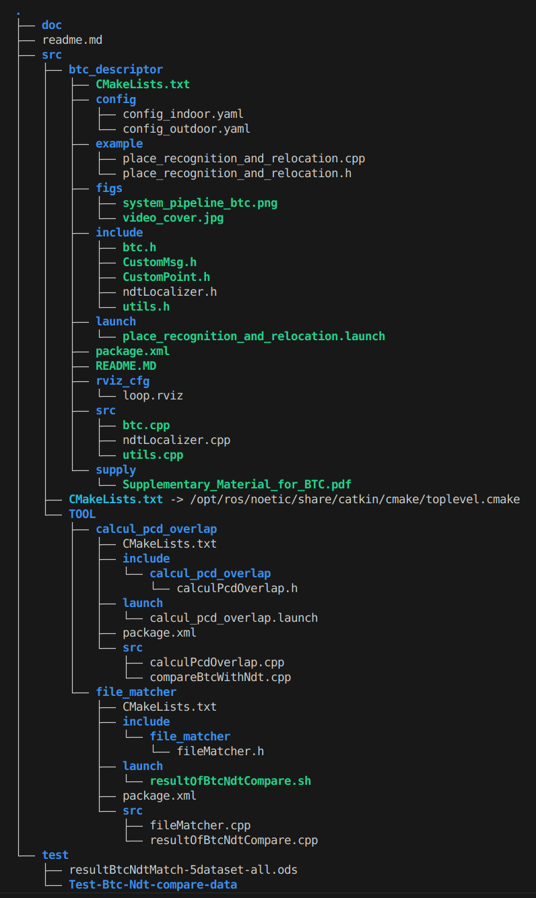

# 0.TODO
已经申请一项中国发明专利。稍后有时间我会整理readme.md，希望我不会再次放鸽子。

# 1.简介

* 基于BTC描述符开发的一套**点云场景识别与重定位算法**
* 根据多数据集测试，BTC在**速度**和**精度**上均具备**较强优势**
* 项目创建于：2025-01-17
* 项目启动于：2025-02-10
* 项目完结于：2025-02-28
* 数据集来源：BXN

# 2.文件框架

<div style="text-align: center;">
    
</div>

# 3.技术流程概述

* 使用关键帧的点云与pose作为输入，**构建BTC描述符**作为全局字典；
* 每帧检查回环，使用当前BTC描述符在全局BTC字典中检索以得到**粗匹配**结果；
* 基于point-point计算点云重合度以**筛除误匹配**；
* 基于plane-plane的ICP算法进行**精匹配**，得到优化后的位姿；
* 基于voxel-voxel计算点云重合度以**量化BTC策略匹配结果**；
* （仅测试时）基于NDT策略开发对应套件，并在相同条件下进行测试；
* （仅测试时）基于voxel-voxel计算点云重合度以量化NDT策略匹配结果；
* （仅测试时）输出与保存相关数据；
* （仅测试时）使用TOOL工具箱中的文件匹配工具包（file_matcher）进行相同回环帧筛选与对比。


# 4.输入格式

* 点云：.pcd或.bin文件，每个关键帧为一个文件，所有文件放在一个文件夹下；
* 位姿：.txt文件，且符合下列格式：

```
// Each keyframe pose occupies one line
time x y z orientation.x orientation.y orientation.z orientation.w
```

# 5.启动

在[launch](src/btc_descriptor/launch/place_recognition_and_relocation.launch)和[config](src/btc_descriptor/config/config_outdoor.yaml)中完善相关参数与路径，在终端中键入：
```
source ./devel/setup.bash
roslaunch btc_desc place_recognition_and_relocation.launch
```

# 6.日志

**1.2025-02-11：**
```
对BTC提取采用了sub-map方法，提高了BTC场景识别-粗匹配的检出率；
```

**2.2025-02-12：**
```
对BTC内的粗回环检测部分进行优化改进，加入距离阈值的判断，降低BTC场景识别-粗匹配的误判率；
```

**3.2025-02-13：**
```
增加平面可视化功能，提供灵活的API，便于观测；新增PlaceRecognitionList结构体，作为粗匹配+场景识别的最终结果保存格式；
```

**4.2025-02-14：**
```
完成精匹配API接口贯通，现已打通精匹配流程；
```

**5.2025-02-15：**
```
生成BTC的是odom下的实时点云，因此BTC、平面特征均是odom坐标系下；BTC粗匹配的结果loop_transform是curr近似的一个定位误差；
```

**6.2025-02-17：**
```
精匹配已得到运行；
```

**7.2025-02-19：**
```
精匹配已得到验证：输出的位姿纯算法优化未必真值，但基于优化结果对同场景点云的拼接却是极度重合准确的。
```

**8.单帧完整BTC耗时：**
```
30ms；10帧拼接完整BTC耗时：150ms。拼接与否，点云拼接重合效果都很好。
```

**9.2025-02-20：**
```
新增NDT匹配模块，完成所有API。
```

**10.2025-2-21：**
```
修复了NDT模块的一些已知问题，增加可视化与测试打印。
```

**11.2025-2-25：**
```
完善了BTC-NDT效果对比的输出格式，即采用统一curr单帧(基于ori与opti-*生成的全局点云)与其loop(未必同帧，采用相同的submap构建方式)进行对比；也进行了耗时对比。
```

**12.2025-2-26：**
```
内嵌重合度算法模块，对BTC/NDT重定位优化效果进行统计学定量分析；优化BTC内存管理。
```

**13.2025-2-27：**
```
增加BTC/NDT-CPO重叠度计算结果导出模块，新开发FileMatcher工具库，修复一处位姿坐标变换数学错误，已证实BTC在点云重合与位姿优化方面均有很大优势。
```

**13.2025-03-05：**
```
最终整理代码，完善readme文档。
```

## 7.测试日志

* BTC在180°场景-单雷达倾斜-回环中，cpo提升下降，原因是雷达倾斜导致点云不均，180°场景除非拼接特别特别多否则会导致curr-loop的（点云）平面交集很少，精匹配约束过少，例如十字路口planes=480，180°场景或为300。
* 研究发现，二进制描述子（三角形描述子的顶点）大部分位于道路两侧建筑物等有高度的物体上，地面上很少。包括宽马路高架遮挡等会导致180°无法回环（倒也正常）;
* 在5个dataset上，BTC较NDT整体速度提升至少约3.70倍，重定位精度提升约14.75%。
